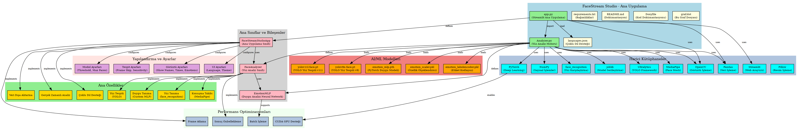
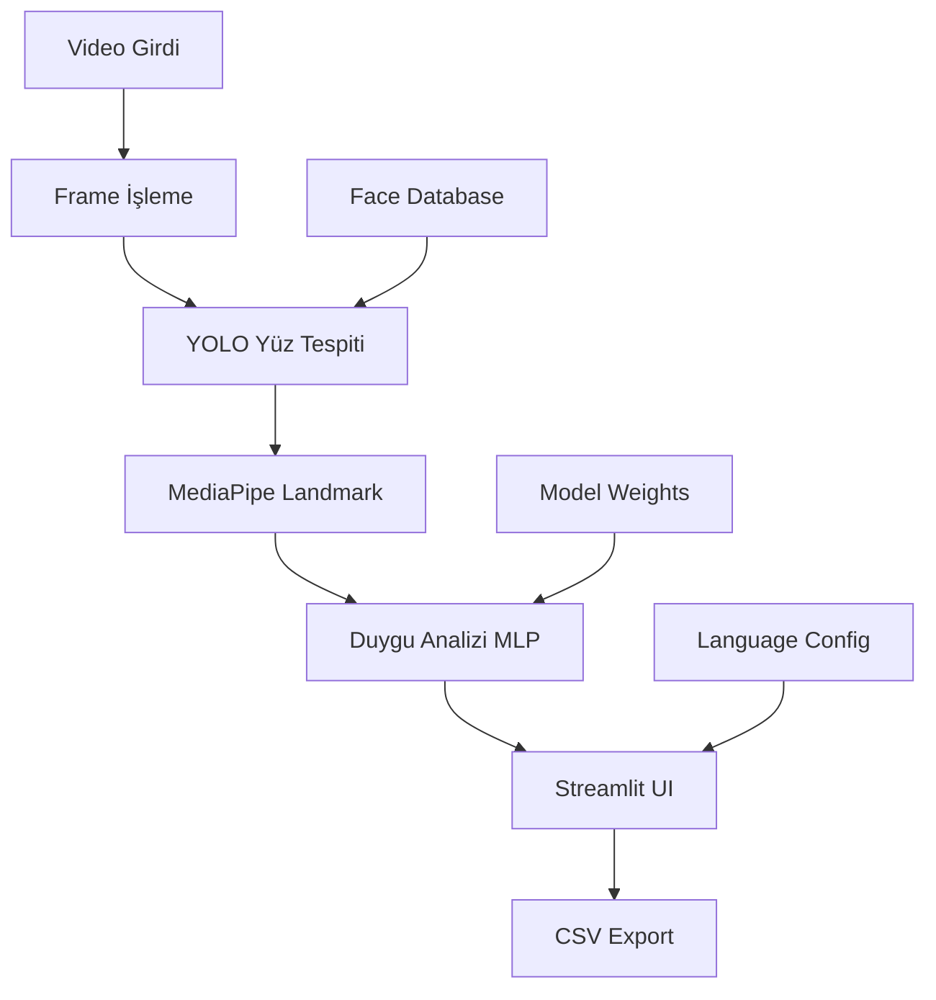

# 🎬 FaceStream Studio


## 🔥 Gerçek Zamanlı Yüz Analizi ve Konuşma Takibi Uygulaması

Yapay zeka destekli yüz tanıma, duygu analizi ve konuşma süresi ölçümü ile gelişmiş video analiz platformu

### ✨ Yenilikler

- 🧠 **Özel PyTorch MLP Modeli** ile gelişmiş duygu analizi
- ⚡ **CUDA GPU desteği** ile hızlandırılmış işlem
- 🎯 **MediaPipe Face Mesh** ile hassas yüz landmark tespiti
- 📊 **Gelişmiş konuşma analizi** ve süre takibi
- 🌐 **Çoklu dil desteği** (Türkçe/İngilizce)

---

## 📋 İçindekiler

- [🏗️ Proje Mimarisi ve Graf](#️-proje-mimarisi-ve-graf)
- [🚀 Özellikler](#-özellikler)
- [🎯 Kullanılan Teknolojiler](#-kullanılan-teknolojiler)
- [📦 Kurulum](#-kurulum)
- [🏃‍♂️ Hızlı Başlangıç](#️-hızlı-başlangıç)
- [📖 Kullanım Kılavuzu](#-kullanım-kılavuzu)
- [⚙️ Ayarlar ve Yapılandırma](#️-ayarlar-ve-yapılandırma)
- [🧠 Yapay Zeka Modelleri](#-yapay-zeka-modelleri)
- [🛠️ Sorun Giderme](#️-sorun-giderme)
- [📈 Performans Optimizasyonu](#-performans-optimizasyonu)
- [🤝 Katkıda Bulunma](#-katkıda-bulunma)
- [🔧 Geliştirme](#-geliştirme)
- [📄 Lisans](#-lisans)

---

## 🏗️ Proje Mimarisi ve Graf

FaceStream Studio projesi, modern AI/ML teknolojilerini kullanarak gerçek zamanlı yüz analizi yapan kapsamlı bir sistemdir. Aşağıdaki graf, projenin tüm bileşenlerini, bağımlılıklarını ve veri akışını detaylı olarak göstermektedir:



### 📊 Graf Açıklaması

**🎨 Renk Kodları:**

- 🟢 **Yeşil**: Python dosyaları (app.py, Analyzer.py)
- 🟠 **Turuncu**: AI/ML model dosyaları (.pt, .pth, .pkl)
- 🟡 **Sarı**: Yapılandırma dosyaları (JSON, TXT, MD)
- 🔵 **Mavi**: Harici kütüphaneler ve framework'ler
- 🟣 **Pembe**: Python sınıfları ve bileşenleri
- 🟨 **Altın**: Uygulama özellikleri ve fonksiyonları

**🏗️ Ana Bileşenler:**

1. **Ana Uygulama Katmanı**

   - `app.py`: Streamlit tabanlı web arayüzü
   - `Analyzer.py`: Yüz analizi ve AI işlemleri motoru
   - `languages.json`: Çoklu dil desteği konfigürasyonu

2. **AI/ML Model Katmanı**

   - `yolov11l-face.pt`: YOLO v11 yüz tespit modeli
   - `emotion_mlp.pth`: Custom PyTorch duygu analizi modeli
   - `emotion_scaler.pkl` & `emotion_labelencoder.pkl`: Model ön işleme bileşenleri

3. **Kütüphane Ekosistemi**

   - **Streamlit**: Web arayüzü framework'ü
   - **OpenCV**: Görüntü işleme ve video operasyonları
   - **PyTorch**: Deep learning model inference
   - **MediaPipe**: Yüz landmark tespiti
   - **Ultralytics**: YOLO model implementasyonu

4. **Özellik Katmanı**
   - Gerçek zamanlı yüz tespiti
   - Duygu tanıma sistemi
   - Konuşma analizi ve takibi
   - Çoklu dil desteği
   - Veri dışa aktarma

### 🔄 Veri Akış Diyagramı



### ⚙️ Sistem Mimarisi

**🔧 Modüler Tasarım:**

- **Separation of Concerns**: Her modül belirli bir sorumluluğa odaklanır
- **Loose Coupling**: Bileşenler arası gevşek bağlantı
- **High Cohesion**: İlgili fonksiyonlar aynı modülde gruplandırılmış
- **Scalability**: Yeni özellikler kolayca eklenebilir
- **Maintainability**: Kod bakımı ve güncelleme kolaylığı

**📈 Performans Optimizasyonları:**

- CUDA GPU desteği ile hızlandırılmış hesaplama
- Frame skipping ile gereksiz işlem azaltma
- Model caching ile tekrarlayan hesaplama önleme
- Batch processing ile verimli veri işleme

---

## 🚀 Özellikler

### 🎯 Temel Özellikler

- **🔴 Gerçek Zamanlı Analiz**: Canlı kamera görüntüsü üzerinden anlık yüz analizi
- **🎞️ Video Dosya Analizi**: MP4, AVI, MOV formatlarında video dosya desteği
- **👤 Gelişmiş Yüz Tanıma**: Face Recognition kütüphanesi ile yüksek doğruluk oranı
- **😊 Yapay Zeka Duygu Analizi**: Özel PyTorch MLP model ile 7 farklı duygu tespiti
- **🎙️ Akıllı Konuşma Tespiti**: MediaPipe Face Mesh ile dudak hareketlerinden konuşma analizi
- **⏱️ Detaylı Konuşma Takibi**: Kişi bazında milisaniye hassasiyetinde konuşma süresi ölçümü

### 🛠️ Gelişmiş Özellikler

- **⚡ GPU Hızlandırma**: CUDA desteği ile hızlandırılmış işlem gücü
- **🌐 Çoklu Dil Desteği**: Türkçe ve İngilizce arayüz (languages.json)
- **📊 Veri Analizi**: CSV formatında detaylı sonuç kaydetme ve analiz
- **🎨 Özelleştirilebilir Arayüz**: Streamlit tabanlı modern web arayüzü
- **💾 Dinamik Yüz Veritabanı**: Çalışma sırasında yeni yüzler ekleme ve yönetme
- **🔧 Performans Optimizasyonu**: Frame skip, önbellek sistemi ve akıllı kaynak yönetimi
- **📈 Anlık Metrikler**: Anlık FPS, işlem süresi ve performans metrikleri

---

## 🎯 Kullanılan Teknolojiler

### 🧠 Yapay Zeka/ML Framework'leri

- **🎯 YOLO v11**: Son teknoloji yüz tespiti (yolov11l-face.pt)
- **🔍 Face Recognition**: dlib tabanlı yüz encoding ve tanıma sistemi
- **🧭 MediaPipe Face Mesh**: Google'ın 468 noktalı yüz landmark tespiti
- **⚡ PyTorch**: Özel MLP modeli ile gelişmiş duygu analizi
- **📊 Scikit-learn**: Özellik ölçekleme, seçme ve ön işleme

### 🖥️ Temel Teknolojiler

- **🌐 Streamlit**: Modern, duyarlı web uygulaması framework'ü
- **👁️ OpenCV**: Bilgisayarlı görü ve görüntü işleme
- **🔢 NumPy & Pandas**: Vektörel işlemler ve veri analizi
- **🖼️ Pillow (PIL)**: Görüntü formatları ve işleme
- **🔨 CMake**: C++ bağımlılıkları için derleme sistemi

### ⚙️ Model Mimarisi

```python
# Özel Duygu MLP Mimarisi
DuyguMLP(
  input_dim=936,      # MediaPipe landmarks
  hidden_layers=[2048, 1024, 512, 256, 128],
  num_classes=7,      # 7 duygu kategorisi
  activation="SiLU",  # Swish aktivasyonu
  dropout=0.1-0.3,    # Düzenleme
  batch_norm=True     # Stabilite
)
```

---

## 📦 Kurulum

### 📋 Sistem Gereksinimleri

- **Python**: 3.8+ (3.10+ önerilen)
- **İşletim Sistemi**: Windows 10+, macOS 10.14+, Ubuntu 18.04+
- **RAM**: En az 4GB (8GB+ önerilen)
- **GPU**: CUDA destekli GPU (opsiyonel, 3-5x hızlanma)
- **Kamera**: USB webcam veya dahili kamera
- **Depolama**: En az 2GB boş alan (model dosyaları için)

### 🔧 Hızlı Kurulum

1. **Repository'yi klonlayın**

   ```bash
   git clone <repository-url>
   cd "FaceStream Studio"
   ```

2. **Python sanal ortamı oluşturun** (Şiddetle önerilen)

   ```bash
   # Windows
   python -m venv venv
   venv\Scripts\activate

   # macOS/Linux
   python3 -m venv venv
   source venv/bin/activate
   ```

3. **Gerekli paketleri yükleyin**

   ```bash
   pip install -r requirements.txt
   ```

4. **Model dosyalarını hazırlayın**

   ```bash
   # src/ klasöründe şu dosyalar bulunmalı:
   src/
   ├── yolov11l-face.pt              # YOLO face detection model
   ├── models/
   │   └── torch/                    # PyTorch emotion models
   │       ├── emotion_mlp.pth
   │       ├── emotion_scaler.pkl
   │       └── emotion_labelencoder.pkl
   ```

### 🚀 Çalıştırma

```bash
streamlit run app.py
```

Uygulama `http://localhost:8501` adresinde açılacaktır.

---

## 🏃‍♂️ Hızlı Başlangıç

### ⚡ Uygulamayı Başlatma

```bash
streamlit run app.py
```

Tarayıcınızda `http://localhost:8501` adresine giderek uygulamayı kullanmaya başlayın.

### 🎮 İlk Kullanım Adımları

1. **🌐 Dil Seçimi**: Sol kenar çubuğundan Türkçe/English seçin
2. **📷 Mod Seçimi**: Kamera veya Video analiz modunu belirleyin
3. **⚙️ Model Ayarları**: Eşik değerleri ve performans parametrelerini düzenleyin
4. **👤 Yüz Kaydetme**: Sağ panelden bilinen kişilerin yüzlerini ekleyin
5. **🎬 Analizi Başlatın**: "Başlat" butonuna tıklayarak gerçek zamanlı analizi başlatın

### 🎯 Temel İşlemler

- **Yüz Ekleme**: Fotoğraf yükleyin → İsim girin → "Yüz Ekle"
- **Konuşma Takibi**: Dudak hareketleri otomatik algılanır
- **Duygu Analizi**: Yüz ifadeleri gerçek zamanlı işlenir
- **Veri Kaydetme**: Sonuçlar CSV formatında indirilebilir

---

## 📖 Kullanım Kılavuzu

### 📷 Kamera Modu

#### 🔴 Canlı Analiz

- **Başlatma**: "Başlat" düğmesine tıklayın
- **İzleme**: Gerçek zamanlı yüz tespiti ve duygu analizi
- **Durdurma**: "Durdur" düğmesi ile analizi sonlandırın
- **Sonuçlar**: Konuşma süreleri sağ panelde görüntülenir

#### 👥 Yüz Yönetimi

- **Yeni Yüz Ekleme**: Fotoğraf yükleyin ve isim girin
- **Yüz Silme**: ❌ simgesi ile kayıtlı yüzleri silin
- **Otomatik Tanıma**: Eklenen yüzler otomatik olarak tanınır

### 🎞️ Video Modu

#### 📹 Video Analizi

- **Dosya Yükleme**: MP4, AVI, MOV formatında video seçin
- **Analiz Başlatma**: "🎬 Analiz Başlat" düğmesine tıklayın
- **İlerleme Takibi**: İlerleme çubuğu ile analiz durumunu izleyin
- **Sonuç Görüntüleme**: Tamamlandığında detaylı sonuçlar görüntülenir

---

## ⚙️ Ayarlar ve Yapılandırma

### 🧠 Model Ayarları

| Parametre               | Açıklama                             | Varsayılan | Aralık  |
| ----------------------- | ------------------------------------ | ---------- | ------- |
| **Yüz Eşleşme Eşiği**   | Yüz tanıma hassasiyeti               | 0.6        | 0.3-0.8 |
| **Maksimum Yüz Sayısı** | Aynı anda tespit edilecek yüz sayısı | 5          | 1-20    |
| **Frame Atlatma**       | Performans için frame sayısı         | 2          | 1-10    |

### 🎛️ Tespit Ayarları

| Parametre               | Açıklama             | Varsayılan | Aralık   |
| ----------------------- | -------------------- | ---------- | -------- |
| **Konuşma Hassasiyeti** | Dudak hareketi eşiği | 0.03       | 0.01-0.1 |

### 🖥️ Görüntüleme Seçenekleri

- **✅ İsimleri Göster**: Tanınan yüzlerin isimlerini gösterir
- **✅ Konuşma Sürelerini Göster**: Anlık konuşma sürelerini gösterir
- **✅ Duygu Analizini Göster**: Yüz ifadelerini gösterir
- **✅ Sınırlayıcı Kutuları Göster**: Yüzlerin etrafında kutu çizer

### 🌐 Dil ve Arayüz Ayarları

- **Dil Seçimi**: Türkçe / English
- **Tema**: Açık / Koyu (gelecek sürümlerde)

---

## 🧠 Yapay Zeka Modelleri

### 👁️ Yüz Tespiti - YOLO v11

```python
# Model Dosyası
yolov11l_face_model_yolu = "src/yolov11l-face.pt"  # Yüksek doğruluklu yüz tespiti

# Parametreler
guven_esiği = 0.5    # Tespit güveni
maksimum_yuz = 10    # Her karede maksimum yüz
frame_atlatma = 2    # Her N karede bir işlem
```

### 😊 Duygu Analizi - Özel PyTorch MLP

```python
# Tespit Edilen 7 Duygu
DUYGULAR = [
    "MUTLU",      # 😊 Mutlu
    "ÜZGÜN",      # 😢 Üzgün
    "KIZGIN",     # 😠 Kızgın
    "ŞAŞKIN",     # 😲 Şaşkın
    "NÖTR",       # 😐 Nötr
    "SİNİRLİ",    # 😤 Sinirli
    "KORKMUŞ"     # 😨 Korkmuş
]

# Model Mimarisi
class DuyguMLP(nn.Module):
    def __init__(self, input_dim=936, num_classes=7):
        # 936 özellik MediaPipe landmarklarından
        # Derin sinir ağı, residual bağlantılar
        # SiLU aktivasyon + BatchNorm + Dropout
```

### 🎙️ Konuşma Tespiti - MediaPipe Face Mesh

```python
# Kullanılan Landmark Noktaları (468 toplam landmark)
UST_DUDAK = [13, 82, 81, 80, 78]     # Üst dudak noktaları
ALT_DUDAK = [14, 87, 86, 85, 84]     # Alt dudak noktaları

# Konuşma Algoritması
def konusma_algila(landmarks):
    dudak_mesafesi = dudak_mesafesi_hesapla(landmarks)
    konusma_esiği = 0.03  # Ayarlanabilir
    return dudak_mesafesi > konusma_esiği
```

### 🔧 Model Performansı

| Model          | Doğruluk | Hız (FPS) | GPU Bellek |
| -------------- | -------- | --------- | ---------- |
| YOLO v11 Yüz   | 95%+     | 30-60     | 2GB        |
| Duygu MLP      | 87%      | 100+      | 1GB        |
| MediaPipe Mesh | 99%      | 60+       | 0.5GB      |

---

## 🛠️ Sorun Giderme

### ❌ Sık Karşılaşılan Hatalar

#### 🚫 Model Dosyaları Bulunamadı

```bash
# Hata: src klasörü bulunamadı!
# Çözüm:
mkdir src
# Model dosyalarını src/ klasörüne ekleyin
```

#### 📷 Kamera Açılmıyor

```bash
# Linux için kamera izinleri
sudo usermod -a -G video $USER
# Oturumu kapatıp açın
```

#### 🐍 Bağımlılık Hataları

```bash
# Yeniden yükleme
pip uninstall -r requirements.txt -y
pip install -r requirements.txt --upgrade
```

#### 🔧 CMake Hatası

```bash
# Ubuntu/Debian
sudo apt-get install cmake build-essential

# macOS
brew install cmake

# Windows
# Visual Studio Build Tools yükleyin
```

### 🚨 Hata Kodları

| Kod  | Açıklama             | Çözüm                                    |
| ---- | -------------------- | ---------------------------------------- |
| E001 | Model dosyası yok    | Model dosyalarını src/ klasörüne ekleyin |
| E002 | Kamera erişim hatası | Kamera izinlerini kontrol edin           |
| E003 | Video dosyası bozuk  | Başka bir video dosyası deneyin          |
| E004 | Bellek yetersiz      | Frame skip değerini artırın              |

---

## 📈 Performans Optimizasyonu

### ⚡ Hızlandırma İpuçları

1. **GPU Kullanımı**

   ```python
   # CUDA kurulu ise otomatik GPU kullanımı
   cihaz = torch.device("cuda" if torch.cuda.is_available() else "cpu")
   ```

2. **Frame Skip Ayarı**

   ```python
   # Yüksek frame skip = Daha hızlı işlem
   frame_atlatma = 3  # Her 3 karede bir analiz
   ```

3. **Model Seçimi**

   ```python
   # Hız öncelikli: yolov8n-face.pt
   # Doğruluk öncelikli: yolov11l-face.pt
   ```

### 📊 Benchmark Sonuçları

| Sistem Konfigürasyonu | FPS   | CPU Kullanımı | RAM Kullanımı | İşlem Süresi |
| --------------------- | ----- | ------------- | ------------- | ------------ |
| RTX 4050 + i5-13420H  | 75+   | 25%           | 3.5GB         | <13ms        |
| Sadece CPU (i5-13420H)| 12-15 | 85%           | 4.2GB         | <66ms        |

### 🏗️ Proje Mimarisi

```plaintext
FaceStream Studio/
├── app.py                  # Streamlit ana uygulama
├── Analyzer.py             # FaceAnalyzer sınıfı
├── requirements.txt        # Python bağımlılıkları
├── src/
│   ├── yolov11l-face.pt    # YOLO yüz tespit modeli
│   ├── languages.json      # Dil yapılandırma dosyası
│   └── models/
│       └── torch/              # PyTorch duygu MLP
└── docs/                   # Dokümantasyon ve grafikler
```

### 🔄 İşlem Akışı

1. **Video Girişi** → Kamera/Dosya
2. **Kare İşleme** → YOLO Yüz Tespiti
3. **Yüz Tanıma** → Encoding & Eşleştirme
4. **Landmark Tespiti** → MediaPipe Face Mesh
5. **Özellik Çıkarımı** → 936 boyutlu vektör
6. **Duygu Tahmini** → PyTorch MLP çıkarımı
7. **Konuşma Tespiti** → Dudak mesafesi analizi
8. **Sonuç Toplama** → Anlık istatistikler
9. **Arayüz Güncelleme** → Streamlit görselleştirme

### 📦 Bağımlılıklar

```python
# Temel Bağımlılıklar (requirements.txt)
streamlit           # Web arayüzü framework'ü
opencv-python      # Bilgisayarlı görü
ultralytics        # YOLO modelleri
mediapipe          # Yüz mesh tespiti
numpy              # Sayısal hesaplama
Pillow             # Görüntü işleme
cmake              # C++ derleme sistemi

# Ek Python Paketleri (otomatik kurulum)
torch              # PyTorch derin öğrenme
torchvision        # PyTorch için bilgisayarlı görü
face-recognition   # Yüz encoding/tanıma
scikit-learn       # Geleneksel ML modelleri
pandas             # Veri işleme
joblib             # Model serileştirme
```

### ⚠️ Bilinen Sınırlamalar

- **İşlem Gücü**: Yüksek çözünürlükte GPU gereksinimi
- **Aydınlatma**: Düşük ışıkta performans azalması
- **Çoklu Yüz**: 10+ yüz durumunda FPS düşüşü
- **Model Boyutu**: YOLO v11 modeli ~50MB
- **Platform**: Windows'ta CMake kurulumu karmaşık olabilir

### 🔧 Geliştirme Ortamı

```bash
# Geliştirme kurulumu
git clone https://github.com/kullanici/facestream-studio.git
cd facestream-studio
pip install -r requirements-dev.txt
```

---

## 🤝 Katkıda Bulunma

### 🔧 Geliştirme Ortamı Kurulumu

```bash
# Depoyu fork edin ve klonlayın
git clone https://github.com/YOUR_USERNAME/facestream-studio.git
cd "FaceStream Studio"

# Geliştirme bağımlılıklarını yükleyin
pip install -r requirements.txt
pip install pytest pytest-cov black flake8

# Pre-commit hook kurulumu (isteğe bağlı)
pip install pre-commit
pre-commit install
```

### 📝 Katkı Süreci

1. **Fork** yapın ve **özellik dalı** oluşturun

   ```bash
   git checkout -b ozellik/harika-yeni-ozellik
   ```

2. **Kod yazın** ve **test edin**

   ```bash
   python -m pytest tests/ -v
   black . --check
   flake8 .
   ```

3. **Commit** edin ve **push** yapın

   ```bash
   git commit -m "feat: harika yeni özellik eklendi"
   git push origin ozellik/harika-yeni-ozellik
   ```

4. **Pull Request** oluşturun

### 🧪 Test Yazma

```python
# tests/test_analyzer.py örneği
import pytest
from Analyzer import FaceAnalyzer

def test_face_analyzer_init():
    analyzer = FaceAnalyzer("src/yolov11l-face.pt")
    assert analyzer.device is not None
    assert analyzer.model is not None

def test_emotion_detection():
    # Duygu sınıflandırma testi
    pass
```

### 📋 Katkı Kuralları

- **Kod Stili**: Black formatter kullanın
- **Dokümantasyon**: Yeni fonksiyonlar için docstring ekleyin
- **Test**: Yeni özellikler için test yazın
- **Commit Mesajları**: [Conventional Commits](https://conventionalcommits.org/) formatını kullanın

---

## 🔧 Geliştirme

### 🛠️ VS Code Görevleri

Bu proje VS Code görevleri ile gelir:

```bash
# Streamlit uygulamasını çalıştır
Ctrl+Shift+P → "Tasks: Run Task" → "Run Streamlit App"
```

### 🐛 Hata Ayıklama Modu

```python
# app.py içinde hata ayıklama modu
DEBUG_MODE = True  # Ek loglar ve metrikler için

# Analyzer.py içinde
if DEBUG_MODE:
    print(f"Kare işleme süresi: {processing_time:.2f}ms")
    print(f"Tespit edilen yüzler: {len(faces)}")
```

### 🔍 Profiling

```bash
# Bellek profili
pip install memory-profiler
python -m memory_profiler app.py

# Performans profili
pip install line-profiler
kernprof -l -v app.py
```

### 📝 Katkı Süreci (Detaylı)

1. **Depoyu Fork Edin**

   - GitHub üzerinden projeyi fork edin
   - Kendi hesabınıza kopyalayın

2. **Yerel Kurulum**

   ```bash
   git clone https://github.com/YOUR_USERNAME/facestream-studio.git
   cd "FaceStream Studio"
   git remote add upstream https://github.com/ORIGINAL_OWNER/facestream-studio.git
   ```

3. **Özellik Dalı Oluşturun**

   ```bash
   git checkout -b ozellik/ozellik-adi
   ```

4. **Kod Geliştirin ve Test Edin**

   ```bash
   # Kodunuzu yazın
   # Testleri çalıştırın
   python -m pytest tests/ -v

   # Kod kalitesi kontrolü
   black . --check
   flake8 .
   ```

5. **Commit ve Push**

   ```bash
   git add .
   git commit -m "feat: harika özelliğiniz eklendi"
   git push origin ozellik/ozellik-adi
   ```

6. **Pull Request Oluşturun**
   - GitHub'da Pull Request açın
   - Detaylı açıklama yazın
   - İnceleme bekleyin

### 🔧 Gelişim Yol Haritası

- [ ] **Gerçek Zamanlı Gösterge Paneli**: Canlı metrikler ve performans izleme
- [ ] **Toplu İşleme**: Çoklu video dosyalarını toplu işleme
- [ ] **API Uç Noktası**: REST API ile entegrasyon desteği
- [ ] **Bulut Entegrasyonu**: AWS/Azure bulut dağıtımı
- [ ] **Mobil Uygulama**: React Native ile mobil uygulama
- [ ] **Gelişmiş Analitik**: Detaylı istatistik ve raporlama
- [ ] **Çok Dilli Modeller**: Farklı etnik kökenler için optimize modeller

---

## 📞 İletişim ve Destek

### 📧 İletişim

- **📧 E-posta**: [muhakaplan@hotmail.com](mailto:muhakaplan@hotmail.com)
- **🔗 GitHub**: [github.com/oneoblomov](https://github.com/oneoblomov)
- **💼 LinkedIn**:  [m-kaplan](https://www.linkedin.com/in/m-kaplan-b6b947270/)

### 🆘 Destek

- 🐛 **Hata Bildirimi**: GitHub Issues kullanarak hata bildirimi
- 💡 **Özellik Önerisi**: Yeni özellik önerileri için Discussions
- 📖 **Dokümantasyon**: README ve kod içi yorumlar
- 💬 **Teknik Sorular**: Issues bölümünde Q&A etiketi ile

### 🎯 Proje Durumu

- ✅ **Temel Özellikler**: Tamamlandı ve test edildi
- 🔄 **Optimizasyon**: Devam eden geliştirmeler
- 📈 **Performans**: GPU hızlandırma ve önbellekleme
- 🌍 **Çoklu Dil Desteği**: Aktif

---

## 📄 Lisans

Bu proje MIT Lisansı altında lisanslanmıştır. Detaylar için [LICENSE](LICENSE) dosyasına bakınız.

---

## 🙏 Teşekkürler

Bu proje aşağıdaki açık kaynak projelerden yararlanmaktadır:

- [Ultralytics YOLO](https://github.com/ultralytics/ultralytics)
- [MediaPipe](https://github.com/google/mediapipe)
- [Face Recognition](https://github.com/ageitgey/face_recognition)
- [Streamlit](https://github.com/streamlit/streamlit)
- [OpenCV](https://github.com/opencv/opencv)

---

**⭐ Bu projeyi beğendiyseniz yıldız vermeyi unutmayın!**
